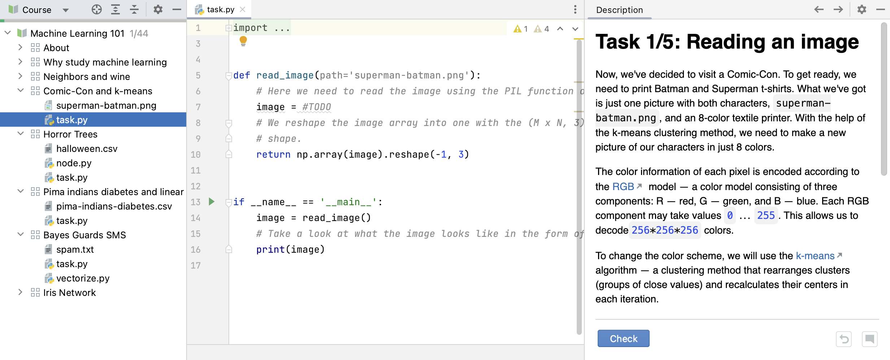

## Framework lessons

This course features one or more framework lessons. Framework lessons aim to emulate the experience of 
working on a real coding project. In such a lesson, as opposed to a regular lesson, you will work with 
code step by step instead of solving separate unconnected tasks.

As always, you will encounter theoretical and hands-on tasks. Navigation between tasks works the same 
as in regular lessons: you can use arrows or the `Next` button.

You can always return to a previous task and re-read or correct something. However, it will not be 
possible to skip tasks because each subsequent task depends on all the previous ones being solved 
correctly as you’re building your project.

In the Course View on the left, you will not see a list of tasks for the current lesson. Instead, you 
will just see the files available to you in the current task. The number and the name of the task can be 
seen above the task description. 

