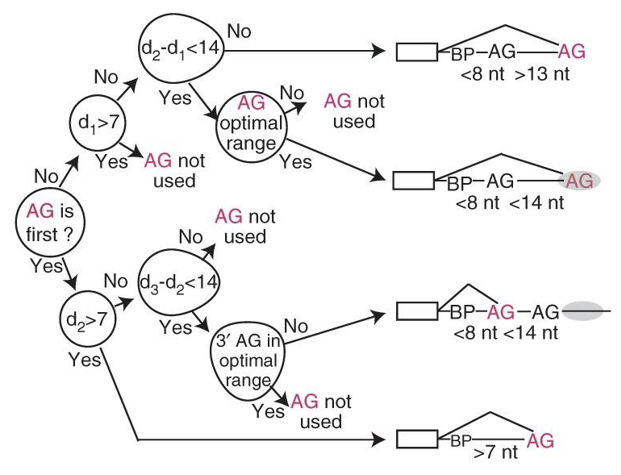

### ID3 application and limitations

ID3 (Iterative Dichotomiser 3) discussed in this course is an algorithm [designed](https://link.springer.com/content/pdf/10.1007%2FBF00116251.pdf) by Ross Quinlan for training decision trees.
It is used for building decision trees on the basis of a certain dataset. 
ID3 is a predecessor of the [C4.5 algorithm](https://en.wikipedia.org/wiki/C4.5_algorithm); it is commonly used in machine learning and in natural language processing, but it also has
numerous applications in such fields as medicine, health care, education, digital forensics,
web-attack detection, etc. ([source](https://ijcsit.com/docs/Volume%206/vol6issue06/ijcsit20150606109.pdf)).

<i>The picture shows an ID3-developed decision tree designed to find out if a base pair in a pre-mRNA sequence matches the mRNA-splicing site.
This tree provided a 95% precision ([source](https://www.ncbi.nlm.nih.gov/pmc/articles/PMC3465671/#R11)). </i>

The ID3 algorithm does not guarantee an optimal solution: it may result in local optimums, as it utilises a greedy approach and chooses the **locally** best attribute for data division at each iteration. 
Each tree division is considered separately, without taking into account possible impacts from
further divisions. It may result in trees that poorly reflect the basic characteristics
of the data, which might lower the efficiency of further classification ([source](https://link.springer.com/article/10.1007/s10994-017-5633-9)). The optimality 
of the algorithm may be improved by the use of [backtracking](https://en.wikipedia.org/wiki/Backtracking) in the process of decision tree building, 
which, however, may lead to an increase in the working time of the algorithm.

The use of ID3 may involve [overfitting](https://en.wikipedia.org/wiki/Overfitting). To avoid it, you should prioritise smaller trees.
The algorithm commonly builds small trees, but not always the smallest possible ones.

It is more difficult to use ID3 with continuous rather than factorized data. Factorized data have a distinct number of
possible values, which reduces the number of possible branching points. Whereas, if the values of a given attribute are continuous,
there are much more division points according to this attribute, and the search for the best division value may
take a while.

To see the results of the algorithm's work, run the code in the `halloween.py` file. Upon its completion, you will
see an image `tree.jpg` in the list of files in Course View – it is our decision tree!

#### Additional information links: 
1) An [example](https://iq.opengenus.org/id3-algorithm/#:~:text=ID3%20algorithm%2C%20stands%20for%20Iterative,or%20minimum%20Entropy%20(H)) of using the ID3 algorithm in weather forecasts.
2) An [article](https://en.wikipedia.org/wiki/ID3_algorithm#cite_ref-2) in Wikipedia on ID3. 
