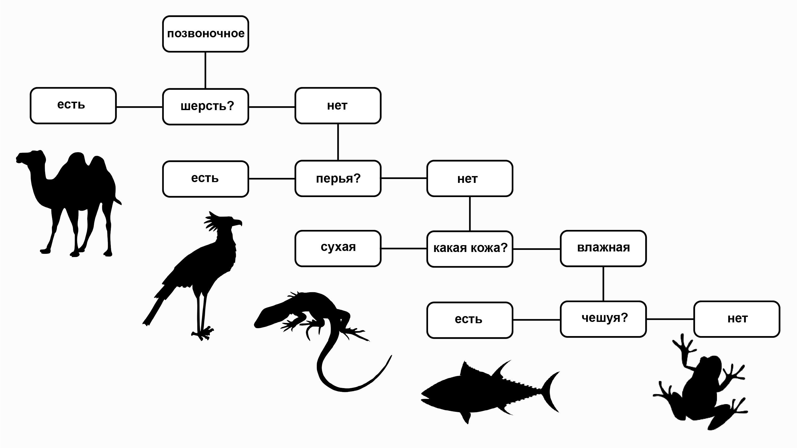

Каждый год наступает Хэллоуин, и к нему лучше быть готовым! 
Неплохо бы заранее научиться отличать чудищ друг от друга. В файле halloween.csv 
находится датасет, содержащий информацию, которая поможет нам различать призраков, 
гоблинов и гулей. Значения колонок указаны в заголовке файла, в качестве меток классов 
будет использоваться последняя колонка &mdash; `type`. В этом наборе данных есть не только 
количественные признаки, как было в предыдущих уроках, но и номинальные (качественные), 
вследствие чего мы не сможем использовать метрический классификатор, который полагается на 
расстояние между объектами. Вместо этого, мы будем использовать решающее дерево.

## Решающие деревья
[Решающие деревья](https://ru.wikipedia.org/wiki/%D0%94%D0%B5%D1%80%D0%B5%D0%B2%D0%BE_%D1%80%D0%B5%D1%88%D0%B5%D0%BD%D0%B8%D0%B9) воспроизводят логические схемы, позволяющие получить окончательное решение 
о классификации объекта с помощью ответов на иерархически организованную систему вопросов, 
причём вопрос, задаваемый на каждом последующем уровне, зависит от ответа, полученного на 
предыдущем уровне. Подобные логические модели издавна используются в ботанике, зоологии, минералогии, 
медицине и зачастую реализованы в виде [ключей-определителей](https://ru.wikipedia.org/wiki/%D0%9A%D0%BB%D1%8E%D1%87_%D0%B4%D0%BB%D1%8F_%D0%BE%D0%BF%D1%80%D0%B5%D0%B4%D0%B5%D0%BB%D0%B5%D0%BD%D0%B8%D1%8F) с тезами и антитезами ([пример](http://antonlyakh.ru/blog/pictures/pr-lavrenko-1955-blacksea-diatoms.png)).

Пример решающего дерева показан на рисунке. Изображенной схеме принятия решений 
соответствует связный ориентированный ациклический граф &mdash; ориентированное дерево. Дерево включает 
в себя корневую вершину, инцидентную только выходящим ребрам, внутренние вершины, инцидентные 
одному входящему ребру и нескольким выходящим, и листья &mdash; концевые вершины, инцидентные только 
одному входящему ребру.

Каждой из вершин дерева за исключением листьев соответствует некоторый вопрос, подразумевающий 
несколько вариантов ответов, соответствующих выходящим ребрам. В зависимости от выбранного 
варианта ответа осуществляется переход к вершине следующего уровня. Концевым вершинам поставлены 
в соответствие метки, указывающие на отнесение распознаваемого объекта к одному из классов.

## Задание

В файле `node.py` реализуйте класс `Node` для хранения узла в дереве принятия решений. Класс должен содержать 
следующие атрибуты: ссылки на свои поддеревья `false_branch` и `true_branch`, а также предикат, 
по которому происходит деление на поддеревья. Предикат будет удобно хранить в виде номера признака (то есть колонки в файле `halloween.csv`), 
по которому происходит деление выборки, и его значения. Не забудьте удалить оператор `pass`.

Вы можете запускать `task.py` в каждом задании, чтобы посмотреть, как работает ваш код. 
В этом задании модифицировать `task.py` не нужно.

> <i>Этот курс сейчас в альфа-версии. Пожалуйста, помогите нам его улучшить. Для этого вы можете ответить
> на вопросы к каждому из заданий данного урока в опроснике по <a href="https://docs.google.com/forms/d/e/1FAIpQLSeCwqS-shsmh0fRT6Xr6n_RHeMEuQ8_7zPFsx_B22_5YUXYSQ/viewform?usp=sf_link">ссылке</a>.
> Cпасибо :) </i>