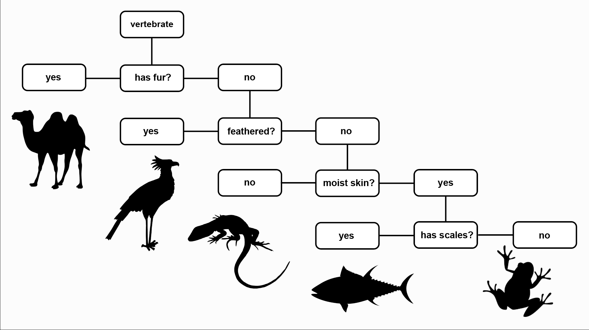

Halloween comes every year, and you better be ready for it! It might be a good idea to learn to tell one monster from another.
The halloween.csv file
contains a date set with the information that will help us distinguish between ghosts, 
goblins, and ghouls. The meaning of columns is indicated in the file header; the last column,
 `type`, will be used as class labels. This dataset contains not only quantitative characteristics, like in the
previous lessons, but also nominal (qualitative) ones. That's why we cannot use the metric classifier,
which relies on the distance between objects.
Instead, we will use a decision tree.

## Decision trees
[Decision trees](https://ru.wikipedia.org/wiki/%D0%94%D0%B5%D1%80%D0%B5%D0%B2%D0%BE_%D1%80%D0%B5%D1%88%D0%B5%D0%BD%D0%B8%D0%B9) reproduce logical schemes that allow classifying objects by means of finding answers to
a hierarchically organized system of questions,
which implies that the question asked at each subsequent level depends on the answer
received at the preceding level. Such  logical models have been used in botany, zoology, mineralogy, medicine for quite a while; in many cases, they have been realized as
[identification keys](https://ru.wikipedia.org/wiki/%D0%9A%D0%BB%D1%8E%D1%87_%D0%B4%D0%BB%D1%8F_%D0%BE%D0%BF%D1%80%D0%B5%D0%B4%D0%B5%D0%BB%D0%B5%D0%BD%D0%B8%D1%8F) with theses and antitheses ([example](http://antonlyakh.ru/blog/pictures/pr-lavrenko-1955-blacksea-diatoms.png)).

In the picture, you can see an example of a decision tree.
The depicted scheme of decision-making corresponds to
a connected oriented acyclic graph, i.e., an oriented tree. The tree includes a root vertex
incidental only to the outgoing branches,
internal nodes incidental to one incoming branch and to several outgoing ones,
and leaves – terminal nodes incidental to only one incoming branch. 

Each tree node corresponds to a certain question, which implies several answer options related to respective outgoing branches.
Depending on the chosen answer variant,
the algorithm proceeds to a next level node.
Terminal nodes correspond to the labels indicating that the object is assigned to a certain class.

## Task

In the file `node.py`, realize the class `Node` for keeping a node in the decision tree. The class 
should contain the following attributes: references to its subtrees `false_branch` and `true_branch` and a predicate,
according to which subtrees are divided. It will be convenient to save the predicate as the number of a characteristic (i.e., the column in the `halloween.csv` file) 
according to which the sample is divided, and its value. Don't forget to delete the `pass` operator.

You can launch `task.py` in each task in order to see how your code is working.
In the current task, you don't need to modify `task.py`.

> <i>This course is currently in the Alpha version. You can help us improve it by answering questions after each task in the following
> <a href="https://docs.google.com/forms/d/e/1FAIpQLSeCwqS-shsmh0fRT6Xr6n_RHeMEuQ8_7zPFsx_B22_5YUXYSQ/viewform?usp=sf_link">form</a>.
> Thanks :) </i>