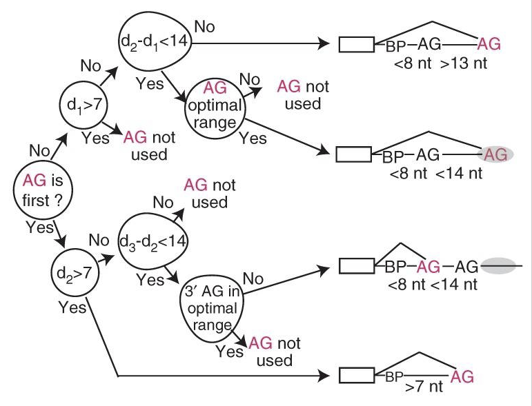

### Применение и ограничения ID3

ID3 (Iterative Dichotomiser 3), рассмотренный нами в этом курсе, – это алгоритм обучения дерева решений, 
[придуманный](https://link.springer.com/content/pdf/10.1007%2FBF00116251.pdf) Россом Куинланом и используемый для создания дерева решений на основе некоторого набора данных. 
ID3 является предшественником алгоритма C4.5 и обычно используется в машинном обучении и для обработки естественного 
языка, однако имеет множество приложений и в таких областях, как медицина, здравоохранение, образование, компьютерная 
криминалистика, распознавание веб-атак, и т.д. ([источник](https://ijcsit.com/docs/Volume%206/vol6issue06/ijcsit20150606109.pdf)).

<i>На рисунке показано созданное с помощью ID3 дерево решений, использованное для определения того, соответствует ли конкретная пара
нуклеотидов в последовательности пре-мРНК сайту сплайсинга мРНК. Это дерево имело 95% точность предсказаний ([источник](https://www.ncbi.nlm.nih.gov/pmc/articles/PMC3465671/#R11)). </i>

Алгоритм ID3 не гарантирует оптимальное решение: он может сходиться на локальных оптимумах, так как использует жадную стратегию, 
выбирая на каждой итерации **локально** лучший атрибут для разделения данных. Каждое разбиение в дереве рассматривается изолированно, 
без учета возможного воздействия будущих разбиений. Это может привести к появлению деревьев, которые плохо отражают основные 
характеристики данных, что потенциально снижает производительность при последующей классификации ([источник](https://link.springer.com/article/10.1007/s10994-017-5633-9)). Оптимальность 
алгоритма может быть улучшена за счет использования поиска с возвратом ([backtracking](https://ru.wikipedia.org/wiki/%D0%9F%D0%BE%D0%B8%D1%81%D0%BA_%D1%81_%D0%B2%D0%BE%D0%B7%D0%B2%D1%80%D0%B0%D1%82%D0%BE%D0%BC)) во время построения оптимального дерева 
решений, что, однако может приводить к увеличению времени его работы.

При использовании ID3 возможно [переобучение](http://www.machinelearning.ru/wiki/index.php?title=%D0%9F%D0%B5%D1%80%D0%B5%D0%BE%D0%B1%D1%83%D1%87%D0%B5%D0%BD%D0%B8%D0%B5). Чтобы избежать этого, следует отдавать предпочтение более маленьким деревьям. 
Данный алгоритм обычно создает маленькие деревья, но не всегда минимальные возможные.

ID3 сложнее использовать для непрерывных данных, чем для факторизованных. Факторизованные данные имеют дискретное 
количество возможных значений, что уменьшает количество возможных точек ветвления, а если значения любого заданного атрибута 
являются непрерывными, то существует гораздо больше мест для разделения данных по этому атрибуту, и поиск лучшего значения для 
разделения может занять много времени.

Чтобы увидеть результат работы алгоритма, запустите код в файле `halloween.py`. По окончании его работы в списке файлов в 
Course View появится изображение `tree.jpg` &mdash; это наше дерево решений!

#### Ссылки для дополнительного чтения (на английском): 
1) [Пример](https://iq.opengenus.org/id3-algorithm/#:~:text=ID3%20algorithm%2C%20stands%20for%20Iterative,or%20minimum%20Entropy%20(H)) использования алгоритма ID3 для предсказания погоды.
2) [Статья](https://en.wikipedia.org/wiki/ID3_algorithm#cite_ref-2) из википедии про алгоритм ID3. 

> <i>Этот курс сейчас в альфа-версии. Пожалуйста, помогите нам его улучшить. Для этого вы можете ответить
> на вопросы к каждому из заданий данного урока в опроснике по <a href="https://docs.google.com/forms/d/e/1FAIpQLSeCwqS-shsmh0fRT6Xr6n_RHeMEuQ8_7zPFsx_B22_5YUXYSQ/viewform?usp=sf_link">ссылке</a>.
> Cпасибо :) </i>