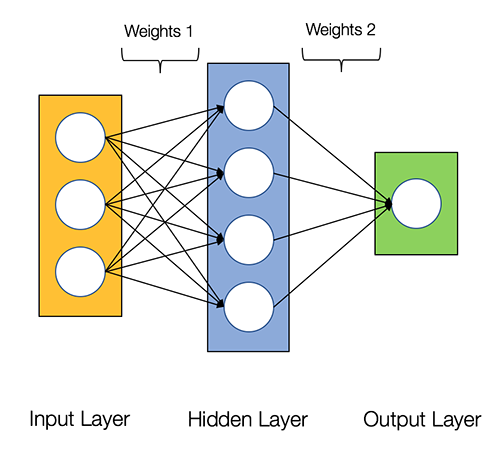

<html>

<h2>Neural network</h2>

A neural network is a group of interconnected neurons. Actually, a neural network is also a function, like a separate neuron, but often a very complex and multi-parameter one. 

Neural networks consist of the following parts:

<ul>
<li>The input layer</li>
<li>An arbitrary number of hidden neurons (hidden layers)</li>
<li>The output layer</li>
<li>A set of weights and biases between the layers, $W$</li>
<li>The choice of an activation function for each hidden layer, $\sigma$</li>
</ul>

Weight is the only connection parameter between two neurons. Due to weights, the input information changes while passing from one neuron to another.

Historically, small random numbers were used in weight initialization (that's what we will use in the current task, too). However, recently, heuristics
have been developed such that they take into account information like the chosen type of the activation function and the number of node inputs.
Such adaptive approaches allow increasing the efficiency of training neural networks.

Below, you can see a 2-layer neural network. The input layer is not considered when we count the number of layers.

<figure>
  
</figure>

When we run the neural network for the very first time, the response will be far from correct because the network hasn't been trained yet. To improve the result
(i.e., the extent to which the classification result of the training sample matches the real classes its objects belong to),
we need to train the network.
In the next chapters of the lesson, we will discuss how it happens.

</html>