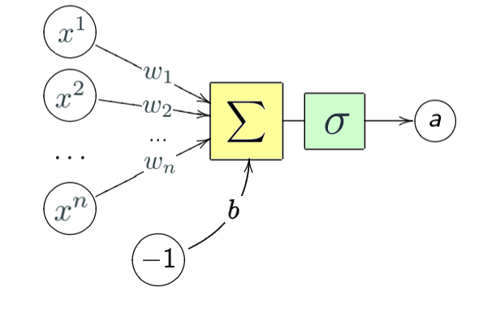

<html>
<h4><i>What knowledge might be of help in this lesson:</h4>

<ul>
  <li>Linear algebra, and, in particular, matrix operations</li>
  <li>Differential calculus</li>
  <li>Vector analysis</li></i>
</ul>

In this lesson, we will build a neural network-assisted classification model based on the data concerning the petal length and width in different
types of irises.

<h2>Neural networks and neurons</h2>

A <a href="https://en.wikipedia.org/wiki/Artificial_neural_network">neural network</a> (or artificial neural network, ANN) is a mathematical model built according to
the organization and functioning principles of biological neural networks – neuron cell networks in live organisms. This concept
was first introduced in the mid-twentieth century in brain research and in attempts to model brain processes.

We will consider an example of the most basic type of neural networks – the <a href="https://en.wikipedia.org/wiki/Feedforward_neural_network">feedforward neural network</a> (FNN),
where all connections strictly follow one direction from the input nodes
to the output nodes.

Neural networks are used to solve complex tasks that require analytical calculations. The most common uses of neural
networks are the following:

<ul>
  <li>Classification</li>
  <li>Prediction</li>
  <li>Recognition</li></i>
</ul>

<h3>Neuron</h3>

The structural unit of neural networks is the <a href="https://en.wikipedia.org/wiki/Artificial_neuron">neuron</a>. It is a function that receives input data,
mathematically transforms them, and outputs a numerical result. There are three main types of neurons:
input, hidden, and output. If a neural network contains a large number of neurons, the concept of
a layer is introduced: the input layer (it receives information), hidden layers
(usually, not more than 3), which process the information, and the output layer, which outputs the result.
Each neuron has input data and output data. In the case of an input neuron,
input=output. All others receive their input as the total information from all the neurons of the preceding layer,
and the result of calculations goes to the output.

<figure>
  
  <figcaption>Artificial neuron scheme.</figcaption>
</figure>

First, the neuron summarizes the values of all input data. The image shows $n$ input signals ($x^1, x^2, \dots x^n$ ).

Before they are summarized, these values are multiplied by weights ($w_1, w_2, \dots w_n$), so the calculated sum
is weighted. Weights can be both positive and negative, and they will be changed during the training process.
For adjustment, bias $b$ may be added to the received output value.

It may be necessary if we want a given neuron to be active at a lower or a higher value of the sum:
for example, if we want the neuron to activate when the weighted sum is not just larger than 0 but
larger than 10, we add a bias of -10.

As we will need to work with diverse input data of different scale, it is necessary to rescale values to a known simple and strict range.
This process is called **normalization**, and it is very common in neural networks.
After summing up the input data and adding the bias, the neuron applies the
<a href="https://en.wikipedia.org/wiki/Activation_function">activation function</a> $\sigma$ to the received value. The activation function "compresses"(standardizes) the numerical series into an interval
from 0 to 1 or from -1 to 1. A logistic sigmoid provides values in the range of [0,1], while, for example,
tanh – in the range of [-1,1].

In the classical case, the logistic <a href="https://en.wikipedia.org/wiki/Sigmoid_function">sigmoid</a> is used as an activation function. 
It gained popularity due to historical reasons. In today's ANN, such a sigmoid is rarely used, as it turned out that
this function negatively affects neural network training. Here are examples of activation functions:

<ul>
  <li>Logistic sigmoid:
    $$\sigma(x) = \frac1{1+e^{-x}}$$</li>
  <li>Hyperbolic tangent:
    $$tanh(x) = 2\sigma(2x) - 1$$</li>
  <li>Rectified Linear Unit (ReLU):
    $$f(x) = max(0,x)$$</li></i>
</ul>

Logistic sigmoid may result in the neural network getting stuck in the process of training because of large negative input values, it
outputs values close to zero. Due to that,
weights will be updated rather slowly. Conversely, the output of the tanh function lies within the range [-1, 1], and 
large negative input values will produce negative output values; only input values close to zero will
produce output values close to zero. This makes the network less inclined to getting stuck during the training process.
Besides, sigmoids can trigger the <a href="https://en.wikipedia.org/wiki/Vanishing_gradient_problem">vanishing gradient problem</a>. 
Rectifiers, such as ReLU, are less subject to the vanishing gradient problem; they are simpler in terms of calculations and in practice, allow faster convergence
than sigmoid functions (<a href="http://www.cs.toronto.edu/~fritz/absps/imagenet.pdf">source</a>).

Here is the formula of a neuron's output data:

$$a = \sigma(\sum\limits_{j=1}^n w_j x^j + b)$$

A little more vividly, this formula may be presented as follows:

$$a = \sigma\left(
\begin{bmatrix}
w_{0,0} &
w_{0,1} &
\cdots &
w_{0,n} \\
w_{1,0} &
w_{1,1} &
\cdots &
w_{1,n} \\
\vdots &
\vdots &
\ddots &
\vdots \\
w_{n,0} &
w_{n,1} &
\cdots &
w_{n,n}
\end{bmatrix}
\begin{bmatrix}
a_{0}^{(0)} \\
a_{1}^{(0)} \\
\vdots \\
a_{n}^{(0)}
\end{bmatrix}
+
\begin{bmatrix}
b_{0} \\
b_{1} \\
\vdots \\
b_{n}
\end{bmatrix}
\right)$$

<h2>Task</h2>
In the <code>activation.py</code> file, use the above formula to implement the logistic activation function <code>sigmoid()</code>.

</html>
