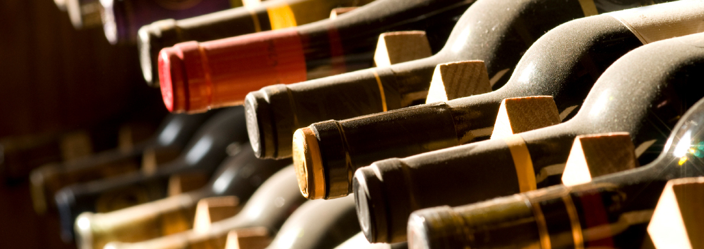

In this lesson, you will have an opportunity to bust the common myth that all wines taste the same and, along the way, figure out the work of the k-nearest neighbors classifier.
The algorithm described here has been realized more than once in a variety of cases, e.g., in the [sklearn](https://scikit-learn.org/stable/modules/generated/sklearn.neighbors.KNeighborsClassifier.html) library. We will discuss and test the sklearn algorithm in the final task of the course.

The file `wine.csv` contains data describing the chemical content of three Italian wines. The first column of each line is the wine identifier, which may equal 1, 2, or 3.
The contents of other columns is explained in the file header.

\
These values are the features you are supposed to use when building the model. A feature is the result of measuring a certain object characteristic. In this task, objects are the different sorts of wine, and their features are numerical values representing some characteristics, like alcohol percentage, magnesium percentage, alkalinity of ash, etc.

It often happens in application tasks that everything measurable gets measured. As a result, there may be more features than needed for building an algorithm and the extra features will slow down the algorithm rather than help it solve the task. There is a "greedy" method of feature selection:
- First, we choose just one feature.
- Then, we add features one by one until it keeps improving the classification result.

In more detail, the algorithm will be considered in the final task of the lesson, after covering the "leave one out" method.

When selecting features, it is often helpful to make graphs: visualization may help us assess certain data patterns, feature distribution, etc.  in advance.

The correct work of an algorithm requires that all features must be presented in the same scale. Otherwise, a feature with the largest value will dominate the metric.

A detailed explanation will be provided in the "k nearest neighbors" task, after the description of metrics.

### Task

Before you start writing the classifier, realize the
functions that divides the sample into [training and test](http://www.machinelearning.ru/wiki/index.php?title=%D0%92%D1%8B%D0%B1%D0%BE%D1%80%D0%BA%D0%B0) sets.

**Training sample** is the sample used for optimizing the parameters of the dependence model. In our case, it is the set of wine characteristics, which our algorithm will use to identify wine classes.
**Test sample** is the sample used to evaluate the quality of our model. It is a set of wines we will use to make sure that our algorithm correctly identifies the wine class based on the features.

Our function must take the data read from a file: the feature matrix `X`, the class identifier vector`y` (the identifiers from the first column), and the proportion of sample breaking (e.g., 20% as the training wine sample and the rest as the test sample).

In Python, the function signature should look as follows:

    def train_test_split(X, y, ratio):
        # ...
        return X_train, y_train, X_test, y_test

The result should comply with the condition:

    len(X_train) / (len(X_test) + len(X_train)) == ratio
    len(y_train) / (len(y_test) + len(y_train)) == ratio

In this course, we will be using the [NumPy](https://docs.scipy.org/doc/numpy-1.15.1/user/index.html) package. Thus, in this task, we will need the [numpy.random.permutation](https://docs.scipy.org/doc/numpy-1.15.0/reference/generated/numpy.random.permutation.html) function, which randomly permutes a sequence. We need it in order to randomly pick wines from the sample and avoid the data bias caused by the order in which the wines were entered into the table. We will aldso need the [numpy.ndarray.shape](https://docs.scipy.org/doc/numpy/reference/generated/numpy.ndarray.shape.html) attribute, which contains the array shape. With its help, you can easily find out the length of the feature matrix and, after multiplying it by the **ratio**, get a matrix part for the training or the test sample.

 
 

> <i>This course is currently in the Alpha version. You can help us improve it by answering questions after each task in the following
> <a href="https://docs.google.com/forms/d/e/1FAIpQLSfix9bjakXkVGr7c0ErZWzzIdGUUAGwASokBj8CB0ql0s5HWA/viewform?usp=sf_link">form</a>.
> Thanks! :) </i>
