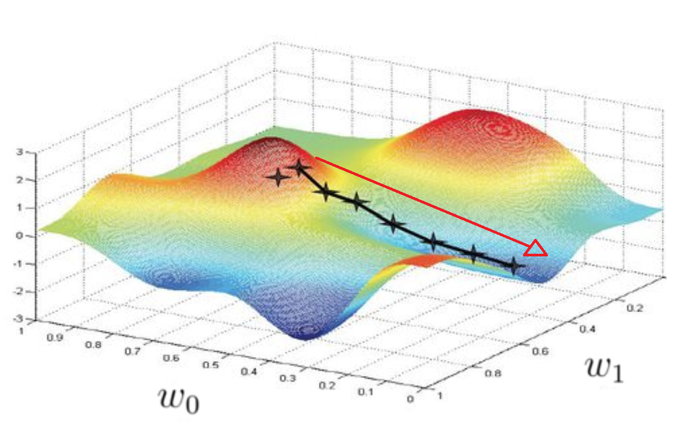

We need to adjust the weight vector $\vec {w}$ – the product of the latter and the feature vector $\vec {x}$ will determine whether we can classify each anamnesis as "a patient with type 2 diabetes" or not.

The loss function measures how badly our model does the job: it compares the answers from the algorithm to the real data. Our task is to minimize this function.

[Gradient descent](https://en.wikipedia.org/wiki/Gradient_descent) is an optimization algorithm that allows ML models to converge to the minimum values through repeated steps.

The [gradient](https://en.wikipedia.org/wiki/Gradient) (or the derivative) shows the direction and rate of the fastest increase of the loss function. Therefore, in order to minimize losses, we need to proceed in the direction opposite to the gradient increase. In the picture, you can see an example of gradient for two weights: $w_0$ and $w_1$. One of its minimums occurs when $w_0 = 0$ and $w_1 = 0.5$. In each iteration, the algorithm will select weight values closer to this minimum, moving along the red arrow.

Here is a simple algorithm of gradient descent:
- Randomly choose the initial weight values $\vec{w}$.

- Calculate the cost function: $$Q(\vec{w}) = \sum\limits_{i \in \text{training set}} L(M_i(\vec{w}))$$
  where $L(M_i(\vec{w}))$ is the loss function, $M_i(\vec{w}) = \langle \vec{w}, \vec{x}_i\rangle y_i$ is the [margin](https://en.wikipedia.org/wiki/Margin_(machine_learning)) – a value defining the distance from the object to the boundary between two classes. The smaller the margin, the greater the possibility of a classification error. The margin is negative when and only when the algorithm makes an error at the given object.

- Calculate the gradients $\bigtriangledown Q(\vec{w})$ of the loss function:
  $\bigtriangledown Q(\vec{w}) = (\frac{\partial Q(\vec{w})}{\partial w_j} )_{j=0}^n
  = \sum \mathcal{L}'(\langle \vec{w}, \vec{x}_i \rangle y_i) \vec{x}_i y_i$

- Update the weight values in proportion to the value of the negative of the gradient (as we are proceeding towards minimizing losses), i.e.,
  $$\vec{w} = \vec{w} - \alpha \bigtriangledown Q(\vec{w})$$
  Here, $\alpha$ is the training rate, which defines the step length in the direction of the negative of the gradient. The smaller it is, the smaller the error probability, although this comes at the cost of the algorithm speed.
- Iterate the process until $Q(w)$ stops decreasing or another pre-defined stop condition is reached.

The algorithm will compare anamnesis data and adjust the weight vector so that with each iteration, a maximum number of cases with or without diabetes would be identified correctly.

The $\alpha$ parameter (training rate) should be adjusted with caution – very high values of $\alpha$ will result in "jumping over" and missing the minimum, while too low values will slow down the algorithm.

### Task

Implement the gradient descent method for training a linear classifier as a class `GradientDescent`. You can find it in the `gradient_descent.py` file.

The `fit` method should return a list of values of the cost function $Q(w)$ at each iteration of the gradient descent.

As a stopping criterion, use the cutoff `threshold` for the distance between the weight vectors in the current and the preceding iteration.
You can choose any distance, for example, Euclidean or `l1`.

In the `precision_recall` file, you will find the functions for calculating precision and recall. You can use them to assess the quality of the classification.

Precision defines the reliability of the classifier. In our case, it will represent the proportion of anamneses for which type 2 diabetes was predicted <b>correctly</b> among the total number of anamneses for which the disease was predicted. The higher the precision, the less frequently the algorithm will make errors in classifying elements.

Recall shows the number of class elements correctly assigned to the class by the algorithm. In our case, it is the proportion of the anamneses correctly assigned to diabetes among the real number of diabetes cases in the sample. The higher the recall, the less frequently the algorithm misses the elements that need to be assigned to a certain class.

In the `utils.py` file, you will find the `train_test_split` function, which splits the given sample into training and control samples. The `plot_classification` function, which you will also find there, builds a graph showing how the classifier's error rate changes with each iteration. If you import this function in task.py, call it in `main`, and run the script, it will visualize the change of the error rate depending on the training rate and the loss function. The graphs for both functions will be saved as images. As we have already mentioned, the gradient descent with low values of training rate converges quite slowly, so be prepared to wait for the results.

Currently, `plot_classification` builds three graphs for each loss function – with $1e-6$, $1e-5$, and $1e-4$ training rates respectively. As we've mentioned above, large values of $\alpha$ may result in the algorithm missing the minimum point – at one step, the algorithm won't reach the stopping condition yet, but at the next step, it will have already left the desired values behind. This will lead to a further decrease of the gradient and the margin and ultimately, result in the ["exploding gradients"](https://machinelearningmastery.com/exploding-gradients-in-neural-networks/) problem. You can see this effect if you set $\alpha = 1e-3$. The margins and gradients will keep growing after passing the minimum until they cause an arithmetic overflow in exponentiation of the loss function and all values become indefinite. There are several solutions to the problem, but we won't discuss them in this course, as the problem will be solved when we modify the algorithm in the next task.

In this task, you might want to use the [numpy.linalg.norm](https://numpy.org/doc/1.18/reference/generated/numpy.linalg.norm.html) function, which calculates matrix norms.