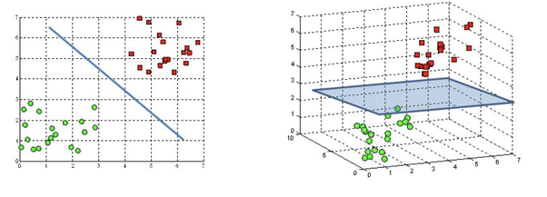

#Introduction

The Pima Indians live in the central and southern parts of Arizona. For some reason that still remains unclear, the Pima are at high risk of developing type 2 diabetes.
One of the hypotheses is that the high incidence of diabetes among native Americans results from a combination of several factors: genetic susceptibility, rapid dietary changes over the last centuries (transition from traditional agricultural produce to processed products), and reduced physical activity. In the current task, we will use the [linear
classifier](https://en.wikipedia.org/wiki/Linear_classifier) to assess whether a person has type 2 diabetes according to their anamnesis.

We've chosen the algorithm due to the following reasons:
- It's hard to calculate the distances between the sample objects – different types of data in each person's anamnesis make it difficult to build a metric.
- It's equally hard to define the predicates – it's unclear which feature combinations affect the disease.
- It's hard to specify the [probability space](https://en.wikipedia.org/wiki/Probability_space) for the objects.

The *gradient descent* algorithm discussed in this lesson does not require calculating distances or building predicates. The objects do not have to be in the same probability space either.
#Description of .csv
The `pima-indians-diabetes.csv` file ([source](https://www.kaggle.com/uciml/pima-indians-diabetes-database)) contains medical data of Pima individuals.
The last column of each line is the indicator of type 2 diabetes. The contents of other columns are explained in the file headers.

#  Task
When implementing the linear classifier, we assume that the objects lie in an `n`-dimensional space and we can define a `(n-1)`-dimensional plane to divide the classes (`n` being the number of features).

First, we need to read the data from the file and reformat it so that it can be used by the algorithm.

Implement the function`read_data`, which takes the path to the data file and returns a pair of NumPy arrays.

- The first element of the pair is a matrix of features `X`, the first column of which contains the constant feature `-1` (it is a pseudo feature, we will refer to it in order to use each object as a vector in a scalar product), and other columns contain the features
  from the data file. The features will be [standardized](https://www.kdnuggets.com/2020/04/data-transformation-standardization-normalization.html), i.e., each feature value will be rescaled around the mean for all objects, and the deviation won't exceed the standard deviation:
  $$ x_{stand} = \dfrac {x - mean(x)} {standard \ deviation (x)}$$
- The second element is the `y` vector, with `-1` signifying the presence of diabetes and `1` — its absence. The vector `y` needs to be normalized – centered around 0 with a unit of 1: {0, 1} -> {1, -1}. This is necessary for making a decision about the presumed class.

In this task, you might need the following functions: <a href="https://numpy.org/doc/stable/reference/generated/numpy.ndarray.mean.html">numpy.ndarray.mean</a>, <a href="https://numpy.org/doc/stable/reference/generated/numpy.ndarray.std.html">numpy.mdarray.std</a>, <a href="https://numpy.org/doc/stable/reference/generated/numpy.concatenate.html">np.concatenate</a>. 

